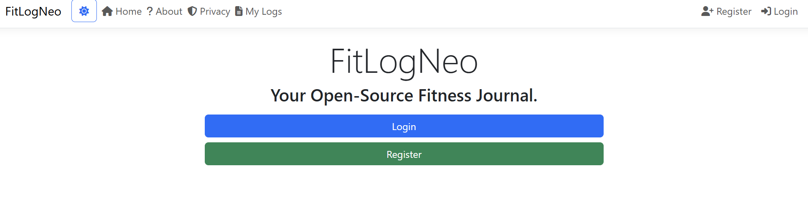
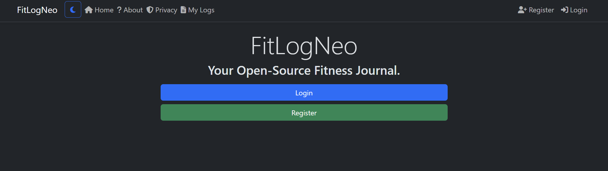
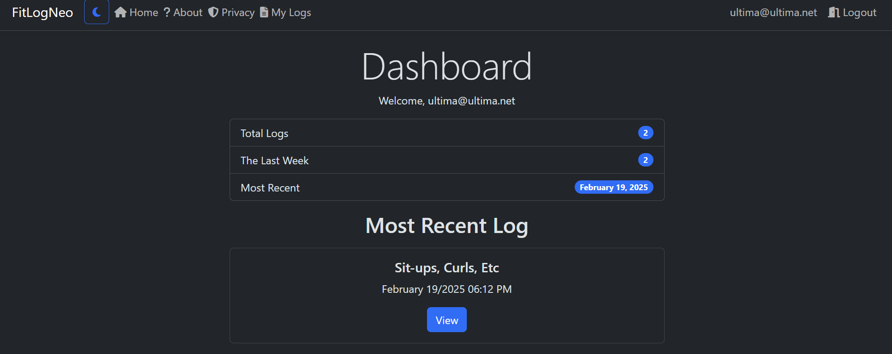
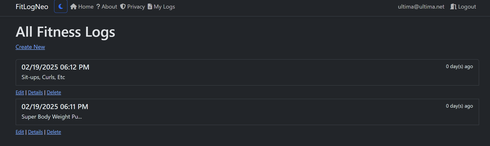
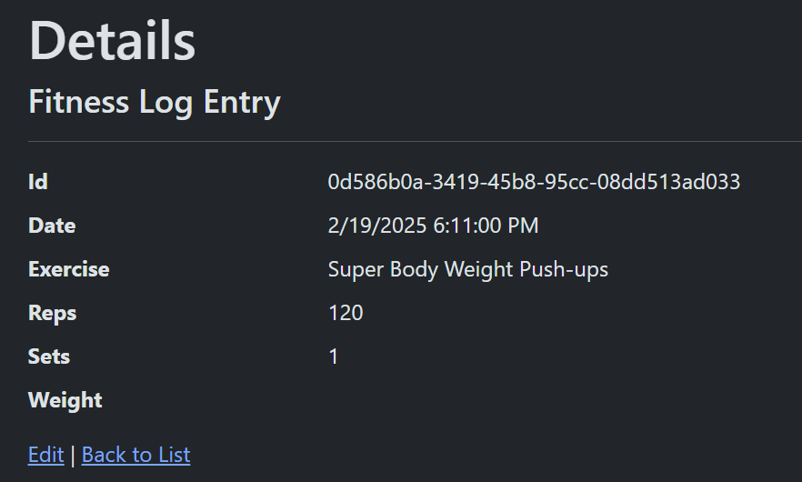
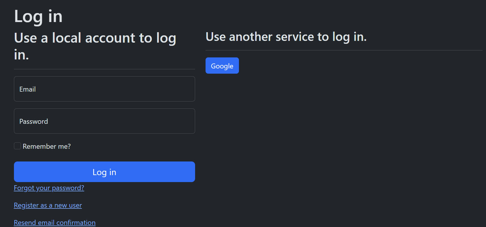

# FitLogNeo - Fitness Journal App

This is a small demo application built using ASP.NET/C#. I built it for fun and
to showcase my expertise in the .NET platform. I also got familiar with OAuth
external authentication using Google. The application allows the user to keep track
of their fitness in FitLogs (Fitness Logs). It is a full-stack application using razor
pages on the frontend and ASP.NET for the backend.

## Screenshots

Light & Dark Mode Available:

Dashboard, List, Show for Fitness Logs:

Regular & Google Authentication Supported:

## License

BSD-3-Clause license, see [LICENSE](./LICENSE.txt) file for details.
